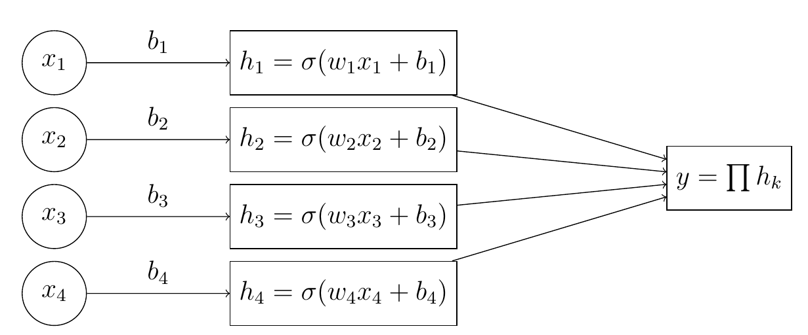

# cabin

`cabin` is a set of simple neural network classes (and custom loss functions) designed to learn selection cuts for tabular data using gradient descent.  A full description of the `cabin` approach to learning cuts is in:

[Learning Selection Cuts with Gradients](https://arxiv.org/abs/2502.08615)

The `OneToOneLinear` class models pass/fail requirements on input features as a sigmoid activation applied to a linear transformation of the input features.  The "cut" can then be extracted from the weight and bias of the linear transformation, which puts the optimal separation point between signal and background at 0.  The output of the network modeling the full set of cuts on input features is the product of all sigmoid-activated linear transformations of the inputs.  The output is bounded in the range [0,1] and resembles a normal classification network result, with events failing any one cut having output scores near zero, and events passing all cuts having scores near 1.  A loss function ([`loss_fn`](https://github.com/scipp-atlas/cabin/blob/main/src/cabin/LossFunctions.py#L72)) included in the `cabin` library permits a `OneToOneLinear` cut network to be tuned to optimize background rejection for a specified target signal efficiency.

The `EfficiencyScanNetwork` class is composed of a collection of `OneToOneLinear` objects that targets a range of signal efficiencies.  Another loss function ([`effic_loss_fn`](https://github.com/scipp-atlas/cabin/blob/main/src/cabin/LossFunctions.py#L122)) can be used to ensure that cuts vary smoothly across different efficiency working points.

The libraries were developed with high-energy physics applications in mind, but the approach can be applied to any binary classification problem.
